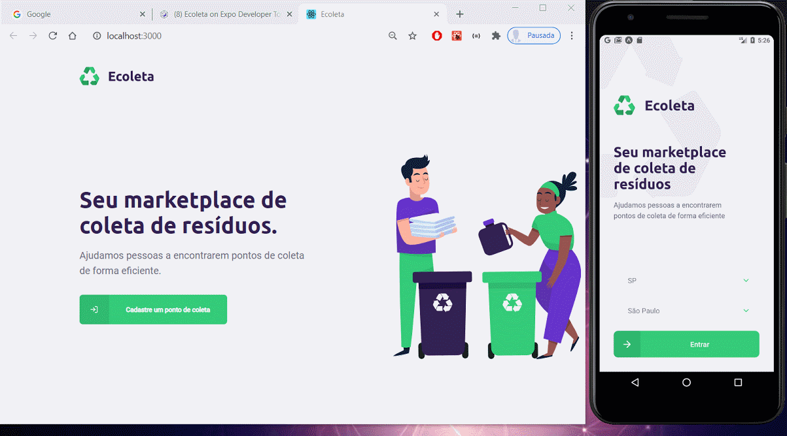

<h1 align="center">♻️Ecoleta♻️</h1>

 
   

<h2>📖 About</h2>

The Ecoleta Project was developed to create a connection between people and companies, which collect organic and inorganic waste, to people and entities in the selective collection of recyclable waste.

------------
<h2>🔖 Layout</h2>

💻📱 &nbsp;Check the layout on <a href="https://www.figma.com/file/cF9QZnP7ogR3vKQMeowzTd/Ecoleta">Figma</a>.

------------

<h2>📚 Documentation</h2>

🚧Under construction🚧.
Access <a href="https://github.com/Nandosbx/Ecoleta/blob/master/DOCUMENTATION.md">Documentation</a> and learn more.

------------

<h2>🚀 Technologies</h2>

This project was developed with:
- [NodeJs](https://nodejs.org/en/ "NodeJs")
- [Express](https://expressjs.com/ "Express")
- [Expo-Cli](https://expo.io/tools#cli "Expo-Cli")
- [React](https://reactjs.org/ "React")
- [React Native](https://reactnative.dev/ "React Native")
- [Typescript](https://www.typescriptlang.org/ "Typescript")

------------

<h3>Dependencies</h3>

- [Express](https://expressjs.com/ "Express")
- [KnexJS](http://knexjs.org/ "KnexJS")
- [SQLite3](https://www.npmjs.com/package/sqlite3 "SQLite3")
- [Axios](https://www.npmjs.com/package/axios "Axios")
- [Leaflet](https://leafletjs.com/ "Leaflet")
- [Expo Google Fonts](https://github.com/expo/google-fonts " [Expo Google Fonts]")
- [Picker Select](https://www.npmjs.com/package/react-native-picker-select "Picker Select")
- [React Native Emoji](https://github.com/EricPKerr/react-native-emoji "React Native Emoji")
- [Multer](https://www.npmjs.com/package/multer "Multer")
- [Celebrate](https://www.npmjs.com/package/celebrate "Celebrate")

------------

<h2>♻️ How to Contribute</h2>

- Fork this repository;

- Make a branch with your feature: `git checkout -b my-feature`

- Commit your changes: `git commit -m 'feat: My new feature'`

- Push your branch: `git push origin my-feature`

------------

<h2>🎓 Developed by</h2>
Happy was developed by <a href="https://github.com/diego3g">Diego Fernandes</a> from <a href="https://rocketseat.com.br/">Rocketseat</a> in the Next Level Week 1.0.

------------

<h2>📃License</h2>

This project is under MIT License. Access <a href="https://github.com/Nandosbx/Ecoleta/blob/master/LICENSE.md">License</a> and learn more.

------------

<footer align="center">
 <strong align="center">Made with 💜 by Fernando Batista</strong>
</footer>