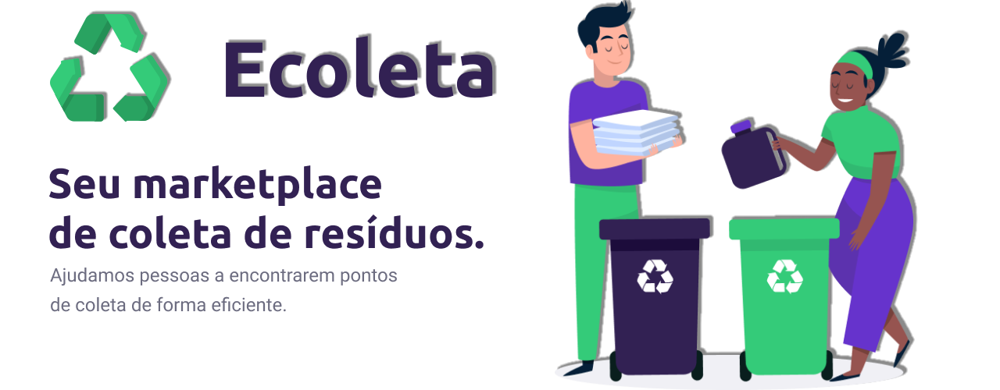

<h1 align="center">♻️Ecoleta♻️</h1>

 
   

 

<h2>📖 Sobre</h2>

Projeto Ecoleta desenvolvido para criar uma conexão entre pessoas e empresas, que coletam resíduos orgânicos e inorgânicos, às pessoas e entidades na coleta seletiva de descartes recicláveis.

------------
<h2>🔖 Layout</h2>

Acesse aqui o layout da ferramenta <a href="https://www.figma.com/file/2C2yvw7jsCOGmaNUDftX9n/Be-The-Hero---OmniStack-11?node-id=0%3A1">Figma</a>.

------------

<h2>📚 Documentação</h2>

Aqui será adicionada uma documentação.

------------

<h2>🚀 Tecnologias</h2>

Este projeto foi desenvolvido com as seguintes tecnologias:
- [NodeJs](https://nodejs.org/en/ "NodeJs")
- [Express](https://expressjs.com/ "Express")
- [Expo-Cli](https://expo.io/tools#cli "Expo-Cli")
- [React](https://reactjs.org/ "React")
- [React Native](https://reactnative.dev/ "React Native")
- [Typescript](https://www.typescriptlang.org/ "Typescript")

------------

<h3>Dependências</h3>

- [Express](https://expressjs.com/ "Express")
- [KnexJS](http://knexjs.org/ "KnexJS")
- [SQLite3](https://www.npmjs.com/package/sqlite3 "SQLite3")
- [Axios](https://www.npmjs.com/package/axios "Axios")
- [Leaflet](https://leafletjs.com/ "Leaflet")
- [Expo Google Fonts](https://github.com/expo/google-fonts " [Expo Google Fonts]")
- [Picker Select](https://www.npmjs.com/package/react-native-picker-select "Picker Select")
- [React Native Emoji](https://github.com/EricPKerr/react-native-emoji "React Native Emoji")
- [Multer](https://www.npmjs.com/package/multer "Multer")
- [Celebrate](https://www.npmjs.com/package/celebrate "Celebrate")

------------

<h2>♻️ Como Contribuir</h2>

- Fork este repositório;

- Crie uma branch com a sua feature: `git checkout -b my-feature`

- Commit suas mudanças: `git commit -m 'feat: My new feature'`

- Push a sua branch: `git push origin my-feature`

------------

<h2>🎓 Quem ministrou?</h2>
A Next Level Week foi ministrada pelo <a href="https://github.com/diego3g">Diego Fernandes</a> da <a href="https://rocketseat.com.br/">Rocketseat</a>

------------

<h2>📃Licença</h2>

Este projeto está sobre a Licença do MIT. Acesse a <a href="https://github.com/Nandosbx/Ecoleta/blob/master/LICENSE.md">Licença</a> e saiba mais.

------------

<footer align="center">
 <strong align="center">Made with 💜 by Fernando Batista</strong>
</footer>